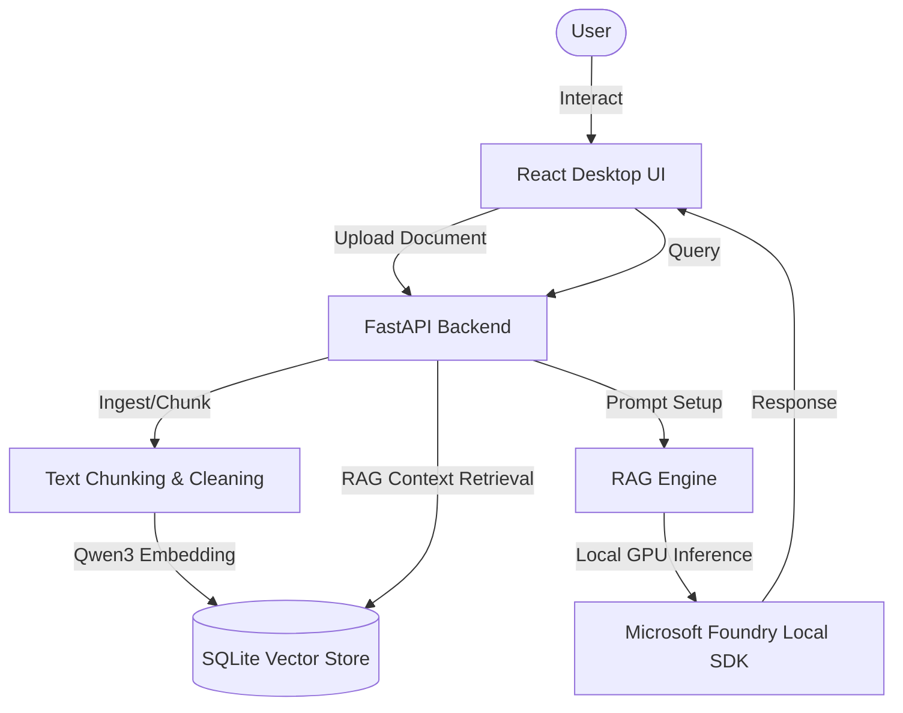

# LocalRAG Assistant 🤖

Developed as part of the **Microsoft Summer Internship Program**, **LocalRAG Assistant** is a fully offline, privacy-centric Retrieval-Augmented Generation (RAG) system. It allows users to index their local documents (PDF, DOCX, PPTX, TXT) and chat with them using local Large Language Models (LLMs) and Embeddings—ensuring that no data ever leaves the local machine.

The project is built on top of the **Microsoft Foundry Local SDK**, utilizing Windows Machine Learning (WinML) with GPU acceleration for highly optimized, offline execution of Phi-3.5 models.

---

## 📖 Table of Contents
1. [Key Features](#-key-features)
2. [Architecture](#-architecture)
3. [Prerequisites](#%EF%B8%8F-prerequisites)
4. [Getting Started](#-getting-started)
   - [Development Mode](#development-mode)
   - [Packaging Standalone App](#packaging-standalone-app)
5. [Configuration & Customization](#-configuration--customization)
6. [Project Structure](#-project-structure)
7. [Turkish Version / Türkçe Sürüm](#localrag-asistanı-tr-)

---

## ✨ Key Features
- **100% Offline & Private:** No APIs, no cloud requests. All document indexing, vector searches, and LLM inferences happen locally.
- **WinML Acceleration:** Leverages DirectX/WinML GPU acceleration via the Microsoft Foundry Local SDK for fast offline performance on Windows machines.
- **Multiple Model Support:**
  - **Chat LLM:** `phi-3.5-mini` (default)
  - **Embedding Models:** `qwen3-embedding-0.6b` (default, fast) and `qwen3-embedding-8b` (high-accuracy)
- **Advanced RAG Control:** Slide parameters in real-time to adjust Top-K context count, Similarity Threshold filters, or enable/disable Strict Fact-Checking constraints.
- **Clean Responsive Desktop UI:** Beautiful sidebar navigation, suggested prompt cards, document upload managers, inline markdown rendering, source document citations, and chunk-level similarity analysis inspect panels.
- **Standalone Desktop Execution:** Package the entire app into a single `.exe` file that boots up in a borderless native `pywebview` frame without console spam.

---

## 🏗️ Architecture



---

## 🛠️ Prerequisites
- **OS:** Windows 10/11 (64-bit) with DirectX 12 compatible GPU.
- **Python:** Version 3.10 or 3.11.
- **Node.js:** Version 18+.

---

## 🚀 Getting Started

### Development Mode

To run and modify the app with hot reloading active:

1. **Setup Python Virtual Environment:**
   ```bash
   python -m venv .venv
   .venv\Scripts\activate
   pip install -r backend/requirements.txt
   ```
2. **Install Frontend Dependencies:**
   ```bash
   cd frontend
   npm install
   cd ..
   ```
3. **Launch Developers Server:**
   Simply double-click the **`start_app.bat`** file or run:
   ```bash
   start_app.bat
   ```
   This will boot the FastAPI server on port 8000, start Vite on port 5173, and launch the RAG chat page in your default browser automatically.

---

### Packaging Standalone App

To package the entire project into a single, clean `.exe` desktop application:

1. Compile the app using the automated build script:
   ```bash
   python build_exe.py
   ```
2. Find the standalone, self-contained binary at the root folder:
   **`LocalRAG-v1.0.0-win-x64.exe`**
3. Double-click to open. It will launch in its own native borderless desktop app window with the database and documents stored directly next to the executable.

---

## ⚙️ Configuration & Customization
Inside the **Settings Modal** (accessible via the gear icon in the app header):
- **Local RAG Context Count (Top-K):** Set how many context blocks (paragraphs) are retrieved.
- **Similarity Search Threshold:** Exclude chunks matching below a specified percentage.
- **Strict Knowledge Base Filter:** Forces the AI to strictly rely on your files and refuse to answer if it can't find relevant facts.
- **Reset to Defaults:** Return settings to their optimal starting configurations instantly.

---

## 📂 Project Structure
```
├── LocalRAG-v1.0.0-win-x64.exe  # Standalone packaged Windows desktop app
├── backend/
│   ├── main.py                 # FastAPI Web API & SDK Integration
│   ├── ingest.py               # PDF/Docx/Pptx Ingestion & Text Splitting
│   └── static/                 # Embedded React build artifacts
├── frontend/
│   ├── src/
│   │   ├── App.jsx             # Chat Application logic & Modals
│   │   ├── App.css             # Fluid responsive layout CSS
│   │   └── main.jsx
│   └── package.json
├── build_exe.py                # Standalone compilation automation script
├── start_app.bat               # Developer environment launcher script
└── README.md                   # Project documentation
```

---

<br/>
<br/>

# LocalRAG Asistanı (TR) 🇹🇷

**Microsoft Yaz Stajı Programı** kapsamında geliştirilen **LocalRAG Asistanı**, tamamen çevrimdışı (offline) çalışan, veri gizliliğini temel alan bir Doküman Tabanlı Soru-Cevap (RAG) sistemidir. Kullanıcıların PDF, DOCX, PPTX ve TXT biçimindeki yerel belgelerini indekslemesini ve bu belgelerle yapay zeka aracılığıyla güvenli bir şekilde sohbet etmesini sağlar. Verileriniz asla bilgisayarınızdan dışarı çıkmaz.

Proje, **Microsoft Foundry Local SDK** üzerine inşa edilmiştir ve Phi-3.5 modellerinin Windows makinelerinde yüksek performansla çalışması için DirectX/GPU destekli Windows Machine Learning (WinML) altyapısını kullanır.

---

## ✨ Temel Özellikler
- **%100 Çevrimdışı ve Güvenli:** API anahtarlarına ve bulut bağlantılarına ihtiyaç duymaz. Tüm veri indeksleme, vektör arama ve yapay zeka işlemleri yerel olarak yapılır.
- **WinML Donanım Hızlandırması:** Windows GPU'nuzu DirectX/WinML kullanarak tam kapasite çalıştırır ve Phi-3.5 modellerini yüksek hızda çalıştırır.
- **Model Çeşitliliği:**
  - **Sohbet Modeli:** `phi-3.5-mini` (Varsayılan)
  - **Vektör Modeli:** `qwen3-embedding-0.6b` (Hızlı, Varsayılan) ve `qwen3-embedding-8b` (Yüksek Doğruluk)
- **Gelişmiş RAG Ayarları:** Top-K bağlam sayısını, benzerlik eşiği (Similarity Threshold) yüzdesini ayarlayabilir veya katı bilgi doğrulama filtresini (Strict Mode) aktif edebilirsiniz.
- **Responsive Masaüstü Arayüzü:** Akıcı kenar çubuğu çekmece menüsü, markdown desteği, belge indeksleme durum paneli ve kaynak döküman alıntı detaylarını gösteren gelişmiş arayüz tasarımı.
- **Tek Dosya Masaüstü Uygulamasını Derleme (.exe):** Tüm projeyi hiçbir terminal penceresi açılmaksızın doğrudan kendi özel penceresinde açılan tek bir `.exe` masaüstü dosyasına paketleyebilirsiniz.

---

## 🚀 Başlangıç

### Geliştirici Modu (Developer Mode)

Uygulamayı çalıştırıp kod üzerinde anlık değişiklikler yapmak için:

1. **Python Sanal Ortamını Hazırlayın:**
   ```bash
   python -m venv .venv
   .venv\Scripts\activate
   pip install -r backend/requirements.txt
   ```
2. **Önyüz Bağımlılıklarını Yükleyin:**
   ```bash
   cd frontend
   npm install
   cd ..
   ```
3. **Projeyi Başlatın:**
   Kök dizindeki **`start_app.bat`** dosyasına çift tıklayın veya terminalden çalıştırın:
   ```bash
   start_app.bat
   ```
   Bu komut arka planda FastAPI sunucusunu ve önyüz sunucusunu ayağa kaldırarak tarayıcınızda sohbet sayfasını otomatik olarak açacaktır.

---

### Tek Dosya Masaüstü Uygulamasını Derleme (.exe)

Tüm projeyi tek bir Windows programı haline getirmek için:

1. Derleme betiğini terminalden çalıştırın:
   ```bash
   python build_exe.py
   ```
2. Kök dizinde oluşan güncel programı bulun:
   **`LocalRAG-v1.0.0-win-x64.exe`**
3. Çift tıklayarak doğrudan kendi bağımsız masaüstü penceresinde kullanmaya başlayabilirsiniz.
